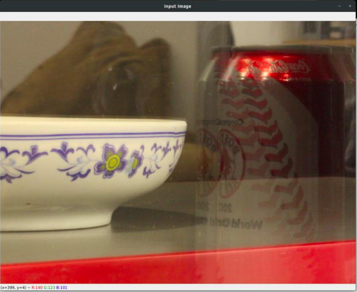
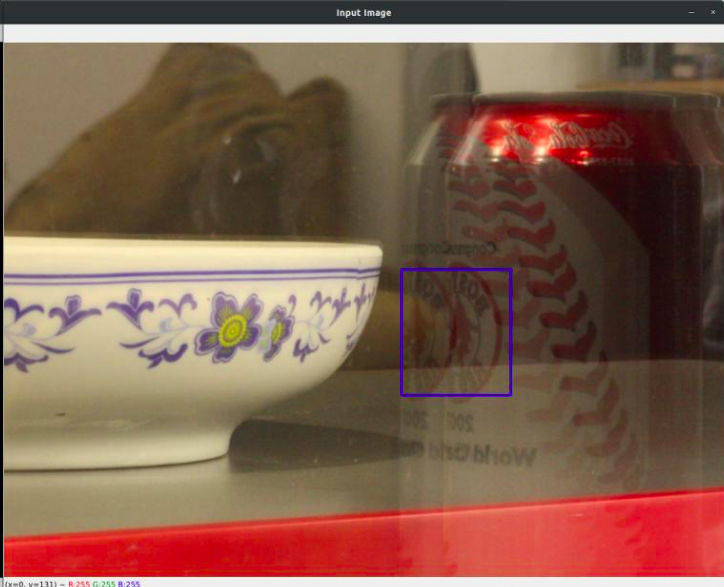

# Reflection Removal by Ghost Effect from A Single Image

### Team Members
- Subodh Sondkar (2018101064) 
- Pranjal Jain (2019101103)
- Ashish Gupta (2019101061)
- Isha Gupta (2019101111)

### Implementation of following Paper
[Reflection Removal using Ghost Effect](https://people.csail.mit.edu/yichangshih/mywebsite/ghost_hidden.pdf)

### Main Goal
- The main goal of our project is to process the images using a proposed algorithm to remove the reflection artifacts caused while capturing image through the glass window.
- The objective is achieved using the ghost effect as a cue to distinguish the reflection image from scene image. ​

### Packages Required
- Scipy 
- Numpy
- OpenCV
- matplotlib
- tqdm

```
For image of size 500x400 it takes almost 10-15 minutes on average CPU. 
```
### Running Instructions
1. Clone the repository
``` 
git clone https://github.com/Digital-Image-Processing-IIITH/dip-project-big-dipper.git 

cd ./dip-project-big-dipper/src
```
2. Open the jupyter-notebook file `Big_Dipper_Studios.ipynb` and run the cells.
3. In the main cell of the file provide the `image path` with respect to `src` directory. i.e. `../images/ghost.png`
4. After running this cell this image opens and user needs to crop a patch of reflection image as a template required for template matching as [Template Selection](#selecting-the-template)
```
- Right click on the image and drag and drop the cursor to crop the image.
- Patch is drawn on the image.
- Now press enter.
```
5. Running process will be started and the output image will be shown on the screen.

### Selecting the template
1. Pop-up for the input image.</br>
 </br>

2. Patch Selection </br>
 </br>
Crop a patch of reflection image as a template.

### Dataset
Drive Link for Input images: 
[Input Images](https://drive.google.com/drive/folders/1IEFlj2F2mXLwiXc8DErDtMda5_fnvX7H?usp=sharing)</br>
Drive Link for Output images:
[Output Images](https://drive.google.com/drive/folders/1t3Ne84Di43xr60iuZRpxq4XdwUQ627oZ?usp=sharing) 
